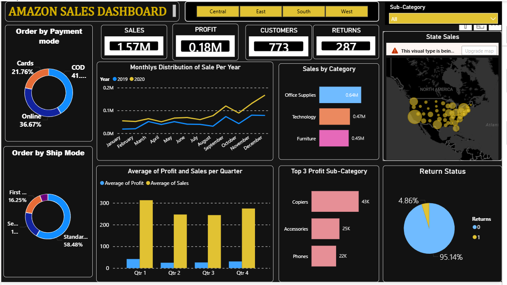

# Amazon-Sales-Dashboard
1.  📊 Amazon Sales Dashboard
> Analyzing retail sales performance across regions, categories, and time using Power BI

2. 📝 Short Description
This dashboard provides a comprehensive view of Amazon sales data, 
helping stakeholders track revenue trends, identify top-performing 
product categories, and monitor return rates across US regions.

3. 🛠️ Tech Stack
Power BI Desktop – Dashboard design & interactive visuals
DAX – Calculated measures and KPIs
Microsoft Excel – Data preparation

4. 🗂️ Data Source
- 📦 Dataset: [Amazon Sales Dataset – Kaggle](https://www.kaggle.com/)
- Contains order-level data with fields: Order ID, Category, 
  Sub-Category, Sales, Profit, Region, Ship Mode, Payment Mode

5.  ✨ Features / Highlights
- 📌 KPI Cards – Sales (1.57M), Profit (0.18M), Customers (773), Returns (287)
- 🗺️ State-wise Sales Map – Geographic distribution across the US
- 📈 Monthly Sales Trend– Year-over-year comparison (2019 vs 2020)
- 🍩 Payment Mode Breakdown – COD, Online, Cards
- 📦 Top 3 Profit Sub-Categories – Copiers, Accessories, Phones
- 🔄 Return Status – 95.14% non-returned orders
- 🔍 Region Filter – Central, East, South, West
- 📊 Quarterly Avg Profit vs Sales – Q1–Q4 performance view

  6. Screenshots
     https://github.com/msupritha22/Amazon-Sales-Dashboard/blob/main/AMAZON.png
     

---

